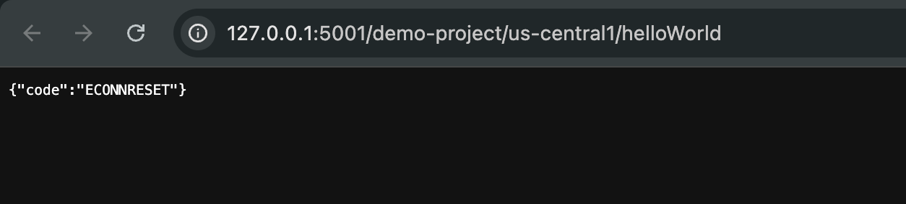

# Repro for issue 7673

## Versions

firebase-tools: v13.17.0
firebase-functions: v6.0.0

## Steps to reproduce

1. Run `cd functions`
2. Run `npm i`
3. Run `firebase emulators:start --project demo-project`
4. Run `curl http://127.0.0.1:5001/demo-project/us-central1/helloWorld` or open the function link in a browser.
   - Errors with:

```
i  functions: Beginning execution of "us-central1-helloWorld"
⚠  functions: TypeError: Cannot read properties of undefined (reading 'setEmulatedAdminApp')
    at Proxy.<anonymous> (/usr/local/lib/node_modules/firebase-tools/lib/emulator/functionsEmulatorRuntime.js:363:34)
    at /Users/<PATH>/functions/index.js:6:11
    at /Users/<PATH>/functions/node_modules/firebase-functions/lib/common/onInit.js:33:16
    at /Users/<PATH>/functions/node_modules/firebase-functions/lib/v2/trace.js:16:28
    at cloudFunction (/Users/<PATH>/functions/node_modules/firebase-functions/lib/v1/providers/https.js:53:78)
    at /usr/local/lib/node_modules/firebase-tools/lib/emulator/functionsEmulatorRuntime.js:532:16
    at runFunction (/usr/local/lib/node_modules/firebase-tools/lib/emulator/functionsEmulatorRuntime.js:506:15)
    at runHTTPS (/usr/local/lib/node_modules/firebase-tools/lib/emulator/functionsEmulatorRuntime.js:531:11)
    at /usr/local/lib/node_modules/firebase-tools/lib/emulator/functionsEmulatorRuntime.js:694:27
    at Layer.handle [as handle_request] (/usr/local/lib/node_modules/firebase-tools/node_modules/express/lib/router/layer.js:95:5)
⚠  Your function was killed because it raised an unhandled error.
i  Request to function failed: Error: socket hang up
```


